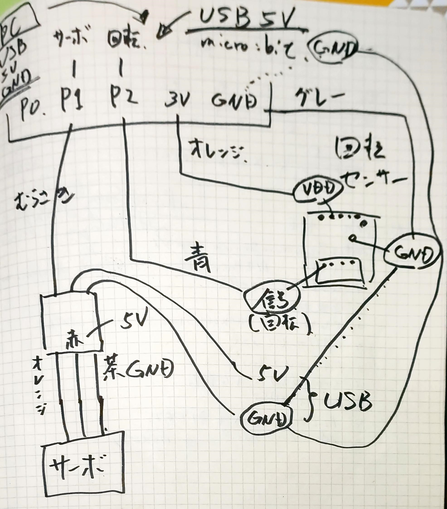

# はじめに

在宅勤務が増え、外出する頻度も少なくなり、運動不足が続いていませんか。BBC micro:bitを活用したプログラミングをしてみましょう。  

[micro:bit mini bicycle](https://github.com/jp-96/microbit-minibicycle)をmicro:bitにインストールすると、マグネット負荷方式の家庭向けサイクルトレーナーの負荷を制御したり、クランクのセンサーから回転数や速度、パワーを算出したりすることが可能となります。また、micro:bitのBluetooth機能を使って、スマホなどと無線通信でき、スマホから、負荷の強度を変更できたり、スマホで回転数や速度、パワーを確認したりできます。

> 補足：BBC micro:bit v1.5をターゲットとしています。  

## 例：マグネット負荷方式の家庭向けサイクルトレーナー

[Amazon: マグネティックバイクミニ （黄色）- 10588](https://amzn.to/3bm5ly5)  
[Amazon: マグネティックバイクミニ （白色）-  9593](https://amzn.to/3bqcnBW)  

# インストール方法

<div style="text-align: center">

</div>

## 必要なもの

1. micro:bit本体 (v1.5)
1. 小型サーボモーター(MG90S等)
1. マグネット負荷方式の家庭向けサイクルトレーナー
1. 3Dプリンターで作成した[パーツ(/docs/print3d/)](/docs/print3d/)
1. 工具、ネジ、配線部品等
1. コンパイル済みのHEX形式ファイル

## コンパイル済みのHEX形式ファイル

次のいずれかの方法で、HEXファイルを入手し、micro:bitに転送（コピー）します。

1. githubからコンパイル済みのHEXファイルをダウンロードする
1. mbed オンライン コンパイラで、プログラムをインポートし、コンパイルする


### 入手方法1 - githubからコンパイル済みのHEXファイルをダウンロードする

次のリンクからHEX形式ファイルをダウンロードし、micro:bitへ転送（コピー）します。  
[microbit-minibicycle.hex](docs/build/microbit-minibicycle.hex)


### 入手方法2 - mbed オンライン コンパイラで、プログラムをインポートし、コンパイルする

1. Mbed オンライン コンパイラを開きます  
   https://ide.mbed.com/compiler/
1. プログラムをインポートします  
   https://github.com/jp-96/microbit-minibicycle.git
1. コンパイルを実行し、コンパイルに成功すると、HEX形式ファイルがダウンロードされます
1. ダウンロードしたHEX形式ファイルをmicro:bitへ転送（コピー）します


## 接続方法

小型サーボモーターをmicro:bitのP1端子へ、センサー信号をmicro:bitのP2端子へそれぞれ接続します。  
配線方法については、手書きの回路図を参考にしてください。

<div style="text-align: center">

</div>

# 使い方

micro:bitのAボタンとBボタンで、負荷を1から8まで変更できます。  
スマホの汎用BLEアプリで、`FTMS:BIT`に接続すると、回転数や速度、パワーを確認したり、スマホから、負荷の強度を変更できたりします。

**【汎用BLEアプリ】**

[Google Play - nRF Connect for Mobile](https://play.google.com/store/apps/details?id=no.nordicsemi.android.mcp&hl=ja&gl=US)  
[App Store - nRF Connect: Bluetooth App](https://apps.apple.com/jp/app/nrf-connect/id1054362403)

## バーチャルライド

いくつかのバーチャルライドアプリも対応していますので、試してみてください。


# 【おまけ】 Windows10でコンパイルする方法

## ツールのインストール 

1. [Git](https://git-scm.com/)
2. [Mercurial](https://www.mercurial-scm.org/)
3. [GNU Arm Embedded Toolchain](https://developer.arm.com/tools-and-software/open-source-software/developer-tools/gnu-toolchain/gnu-rm/downloads) - [**6-2017-q2-update**](https://developer.arm.com/-/media/Files/downloads/gnu-rm/6-2017q2/gcc-arm-none-eabi-6-2017-q2-update-win32-sha2.exe)  
※ GNU Arm Embedded Toolchain  
  → [gcc-arm-none-eabi-6-2017-q2-update-win32-sha2.exe](https://developer.arm.com/-/media/Files/downloads/gnu-rm/6-2017q2/gcc-arm-none-eabi-6-2017-q2-update-win32-sha2.exe)
4. [Python3](https://www.python.org/downloads/)

## 環境構築

コマンドプロンプトを開き、次のコマンドを実行します。  

```CommandPrompt.cmd
py -3 -m pip install --upgrade virtualenv
mkdir c:\workubit
cd c:\workubit
py -3 -m virtualenv venv
C:\workubit\venv\Scripts\activate.bat
pip install mbed-cli git+https://github.com/jp-rad/mbed-microbit-win10-setup.git
mbed config --global GCC_ARM_PATH "C:\Program Files (x86)\GNU Tools Arm Embedded\6 2017-q2-update\bin"

```

## git clone

コマンドプロンプトを開き、次のコマンドを実行します。  

```CommandPrompt.cmd
C:\workubit\venv\Scripts\activate.bat
cd c:\workubit
git clone https://github.com/jp-96/microbit-minibicycle
```

## ライブラリのインポート

コマンドプロンプトを開き、次のコマンドを実行します。     

```CommandPrompt.cmd
C:\workubit\venv\Scripts\activate.bat
cd c:\workubit\microbit-minibicycle
mbedubitwin10

```

## コンパイル

パソコンにBBC micro:bitを接続し、例えば、Dドライブとして認識させます。   
コマンドプロンプトを開き、次のコマンドを実行します。     

```CommandPrompt.cmd
C:\workubit\venv\Scripts\activate.bat
cd c:\workubit\microbit-minibicycle

mbed compile
copy .\BUILD\NRF51_MICROBIT\GCC_ARM\microbit-minibicycle.hex d:\
```

# リンク

## Pythonパッケージ

[mbedubitwin10](https://github.com/jp-rad/mbed-microbit-win10-setup.git)

## GitHubテンプレート

[mbed-microbit-template](https://github.com/jp-rad/mbed-microbit-template.git)

## micro:bit runtime

[micro:bit runtime docs](https://lancaster-university.github.io/microbit-docs/)

## BBC Community Guidelines

[Microbit Community Guidelines](http://microbit.org/community/)
